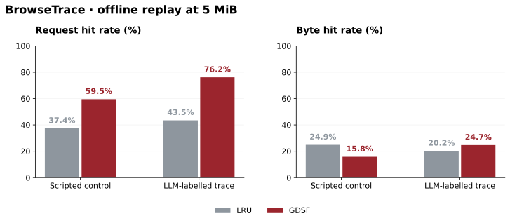

# BrowseTrace

[](LICENSE)
[](LICENSE-DATA)

**Request-level traces and reproducible cache experiments for browser-mediated AI traffic.**

BrowseTrace records how browser workloads interact with web infrastructure: requests, object sizes, timing and cache keys. It includes collection code, typed schemas, sanitization tools and released traces for offline experiments.

[Project & results](https://landigf.github.io/browsetrace.html) · [Dataset card](DATASET_CARD.md) · [Replay results](reports/public-cache-replay.json) · [Historical manuscript](paper/BrowseTrace.pdf)

**Status:** research artifact, not an accepted conference publication. The manuscript is retained as a historical research draft. Earlier IMC badges, proceedings citations and anonymous-author metadata were submission-era material, not evidence of acceptance.

## Results: cache replay



The September 2026 replay uses the public CSVs and libCacheSim 0.3.3.post4. Each policy starts with an empty cache and reads the stored row order. The complete sweep covers six policies at five cache sizes on each of the two aggregate traces.

| Trace | Metric at 5 MiB | LRU | GDSF | GDSF − LRU |
|---|---|---:|---:|---:|
| Scripted control | Request hit rate | 37.4% | 59.5% | +22.1 pp |
| Scripted control | Byte hit rate | 24.9% | 15.8% | −9.1 pp |
| LLM-labelled | Request hit rate | 43.5% | 76.2% | +32.7 pp |
| LLM-labelled | Byte hit rate | 20.2% | 24.7% | +4.5 pp |

**The tradeoff matters:** GDSF improves request hit rate on both released traces, but loses byte hit rate on the scripted control. This is an offline object-cache comparison, not a measured network speedup. The simulator does not enforce HTTP cache-control, freshness, `Vary` or authorization rules. Scripted traffic is not a human baseline.

All values, input hashes and environment details are in [the machine-readable result](reports/public-cache-replay.json). [The plotting script](tools/plot_public_replay.py) produces SVG, PNG and PDF versions.

## What the public release can verify

| Replay input | Request rows | Distinct nonempty session labels |
|---|---:|---:|
| `data/traces/full_400_sessions.csv` | 82,455 | 400 |
| `data/traces/llm_full_901.csv` | 357,782 | 100 |

The legacy `901` filename is preserved so existing scripts still work. **It is not a verified count of independent sessions in the CSV.** Raw LLM session bundles are not included in this public snapshot, so the broader collection inventory, per-model session totals and amplification claims cannot be independently reconstructed from these files. Distinct labels are also not proof of unique collection sessions.

Previous headline totals of 1,301 sessions and 2–5× amplification have been removed from this README because they require evidence beyond this replay. The collector's task/model configuration is available for inspection; it should not be confused with measurements of a complete released corpus.

## Reproduce

The replay makes no model API calls and does not browse the web.

```bash
git clone https://github.com/landigf/BrowseTrace.git
cd BrowseTrace
python3 -m venv .venv
. .venv/bin/activate
pip install libcachesim==0.3.3.post4 matplotlib
python tools/replay_public.py
python tools/plot_public_replay.py
```

Reference replay environment: Python 3.12.2, macOS arm64. Python/package support varies by platform. Plotting the committed JSON needs only Matplotlib; replay requires libCacheSim.

The full sweep covers LRU, LFU, ARC, S3-FIFO, W-TinyLFU and GDSF at 1, 5, 10, 25 and 50 MiB. The historical [submission gate](verify_submission_gate.py) checks the old manuscript's cache tables; it does not certify the missing collection provenance.

## Collection and schema

- [Collector](collection/runner.py) and [task definitions](collection/tasks.yaml): browser execution and request capture.
- [Typed trace schema](schema/trace_schema.py): request context, response metadata, timing and headers.
- [Sanitizer](tools/sanitize_release.py): removes sensitive headers and redacts query values in full trace/log exports.
- [Dataset card](DATASET_CARD.md): release scope, collection background and known limitations.

The cache-replay CSV is a projection with `timestamp_us`, `cache_key`, `object_size_bytes`, `session_id` and `agent_type`. The existing released cache keys preserve URL uniqueness; query redaction in the full trace exports does not imply redaction of the replay CSVs.

## Cite the artifact

```bibtex
@misc{landi2026browsetrace,
  title = {BrowseTrace: Request-Level Traffic Characterization of Browser-Mediated AI Agents},
  author = {Landi, Gennaro Francesco},
  year = {2026},
  howpublished = {Research software and dataset},
  url = {https://github.com/landigf/BrowseTrace}
}
```

See [CITATION.cff](CITATION.cff). Code is [Apache 2.0](LICENSE); released data is [CC BY 4.0](LICENSE-DATA).
